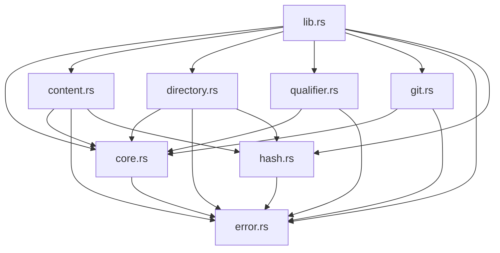

# SWHID Reference Implementation Guide

This document provides a comprehensive guide to the `swhid-rs` reference implementation, explaining the overall architecture and guiding readers through each module with detailed explanations of types, functions, and their relationship to the SWHID v1.2 specification.

## Table of Contents

1. [Architecture Overview](#architecture-overview)
2. [Module Dependencies](#module-dependencies)
3. [Core Module (`core.rs`)](#core-module-corers)
4. [Error Handling (`error.rs`)](#error-handling-errorrs)
5. [Hashing (`hash.rs`)](#hashing-hashrs)
6. [Content Objects (`content.rs`)](#content-objects-contentrs)
7. [Directory Objects (`directory.rs`)](#directory-objects-directoryrs)
8. [Qualified SWHIDs (`qualifier.rs`)](#qualified-swhids-qualifierrs)
9. [Git Integration (`git.rs`)](#git-integration-gitrs)
10. [CLI Interface (`main.rs`)](#cli-interface-mainrs)
11. [SWHID v1.2 Specification Mapping](#swhid-v12-specification-mapping)

---

## Architecture Overview

The `swhid-rs` implementation follows a layered architecture that mirrors the SWHID specification structure:

```
┌─────────────────────────────────────────────────────────────┐
│                    CLI Interface (main.rs)                  │
├─────────────────────────────────────────────────────────────┤
│                 Public API Layer (lib.rs)                   │
├─────────────────────────────────────────────────────────────┤
│  Core Types  │  Content  │  Directory  │  Qualified  │ Git │
│   (core.rs)  │ (content) │(directory)  │(qualifier)  │(git)│
├─────────────────────────────────────────────────────────────┤
│              Hashing Layer (hash.rs)                       │
├─────────────────────────────────────────────────────────────┤
│              Error Handling (error.rs)                     │
└─────────────────────────────────────────────────────────────┘
```

### Design Principles

1. **Specification Compliance**: Every implementation detail maps directly to SWHID v1.2
2. **Modularity**: Each module has a single responsibility
3. **Type Safety**: Strong typing prevents invalid SWHID states
4. **Performance**: Zero-copy operations where possible
5. **Extensibility**: Clean interfaces for future enhancements

---

## Module Dependencies



---

## Core Module (`core.rs`)

**Purpose**: Defines the fundamental SWHID types and parsing logic.

**SWHID v1.2 Mapping**: [Section 3.1 - Core Identifier Format](https://docs.softwareheritage.org/devel/swh-model/data-model.html#core-identifier-format)

### Key Types

#### `ObjectType` Enum
```rust
pub enum ObjectType {
    Content,   // "cnt" - file contents (Git blob)
    Directory, // "dir" - directory (Git tree)  
    Revision,  // "rev" - VCS commit/changeset
    Release,   // "rel" - VCS annotated tag/release
    Snapshot,  // "snp" - snapshot of repository refs
}
```

**Specification Reference**: Maps to the `<object-type>` component in `swh:1:<object-type>:<object-id>`.

**Methods**:
- `as_tag()`: Converts enum to string tag (e.g., `Content` → `"cnt"`)
- `from_tag()`: Parses string tag to enum with validation

#### `Swhid` Struct
```rust
pub struct Swhid {
    object_type: ObjectType,
    digest: [u8; 20],  // SHA-1 digest as 20 bytes
}
```

**Specification Reference**: Implements the complete core identifier format `swh:1:<object-type>:<object-id>`.

**Key Methods**:
- `new(object_type, digest)`: Creates a new SWHID
- `object_type()`: Returns the object type
- `digest_bytes()`: Returns raw 20-byte digest
- `digest_hex()`: Returns lowercase hex string (40 chars)
- `to_string()`: Formats as `swh:1:cnt:...` string
- `parse()`: Parses from string with full validation

**Validation Rules** (SWHID v1.2 Section 3.1):
- Scheme must be exactly `"swh"`
- Version must be exactly `"1"`
- Object type must be one of: `cnt`, `dir`, `rev`, `rel`, `snp`
- Digest must be exactly 40 lowercase hexadecimal characters
- No additional components allowed

### Parsing Logic

The `FromStr` implementation enforces strict validation:

```rust
impl FromStr for SWHID {
    // 1. Split by ':' - must have exactly 4 parts
    // 2. Validate scheme == "swh"
    // 3. Validate version == "1" 
    // 4. Parse object type from tag
    // 5. Validate digest: 40 chars, lowercase hex only
    // 6. Convert hex to 20-byte array
}
```

**Error Cases** (mapped to `SwhidError`):
- Wrong number of components → `InvalidFormat`
- Invalid scheme → `InvalidScheme`
- Invalid version → `InvalidVersion`
- Invalid object type → `InvalidObjectType`
- Invalid digest format → `InvalidDigest`

---

## Error Handling (`error.rs`)

**Purpose**: Centralized error types for all SWHID operations.

**SWHID v1.2 Mapping**: Error conditions defined throughout the specification.

### Error Types

```rust
pub enum SwhidError {
    InvalidFormat(String),        // Malformed SWHID structure
    InvalidScheme(String),        // Wrong URI scheme
    InvalidVersion(String),       // Unsupported version
    InvalidObjectType(String),    // Unknown object type
    InvalidDigest(String),        // Invalid digest format
    InvalidQualifierKey(String),  // Unknown qualifier key
    InvalidQualifierValue { key: String, value: String },
    Io(String),                   // File system errors
}
```

**Design**: Uses `thiserror` for automatic `Display` and `Error` trait implementations, providing detailed error messages with context.

---

## Hashing (`hash.rs`)

**Purpose**: Implements Git-compatible object hashing using collision-detecting SHA-1.

**SWHID v1.2 Mapping**: [Section 3.2 - Object Identifiers](https://docs.softwareheritage.org/devel/swh-model/data-model.html#object-identifiers)

### Core Functions

#### `git_object_header(typ: &str, len: usize) -> Vec<u8>`
Creates Git object headers in the format: `<type> <length>\0`

**Example**: `"blob 12\0"` for a 12-byte blob

**Specification Reference**: Git object format as used by SWHID for content and directory hashing.

#### `hash_blob(data: &[u8]) -> [u8; 20]`
Computes SHA-1 hash of blob content following Git's algorithm:

1. Create header: `"blob <len>\0"`
2. Hash header + data
3. Return 20-byte digest

**Specification Reference**: Content object hashing (Section 3.2.1).

#### `hash_object(typ: &str, payload: &[u8]) -> [u8; 20]`
Generic Git object hashing for any object type.

**Specification Reference**: Used for directory trees and other Git objects.

### Security Considerations

- Uses SHA-1 with collision detection for enhanced security
- Follows Git's exact hashing algorithm
- Validates input data before hashing

---

## Content Objects (`content.rs`)

**Purpose**: Represents and computes SWHIDs for file content.

**SWHID v1.2 Mapping**: [Section 3.2.1 - Content Objects](https://docs.softwareheritage.org/devel/swh-model/data-model.html#content-objects)

### `Content` Struct

```rust
pub struct Content<'a> {
    bytes: Cow<'a, [u8]>,  // Zero-copy for borrowed data
}
```

**Design**: Uses `Cow<[u8]>` to avoid unnecessary allocations when working with borrowed data.

### Key Methods

#### `from_bytes(bytes: impl Into<Cow<'a, [u8]>>) -> Self`
Creates content from any byte source (slice, Vec, etc.).

#### `swhid() -> Swhid`
Computes the content SWHID:
1. Hashes bytes using `hash_blob()`
2. Creates `Swhid` with `ObjectType::Content`

**Specification Reference**: Content objects represent the raw bytes of a file, hashed as a Git blob.

### Usage Examples

```rust
// From string
let content = Content::from_bytes("Hello, World!".as_bytes());
let swhid = content.swhid();
// Result: swh:1:cnt:b45ef6fec89518d314f546fd6c3025367b721684

// From file
let file_data = std::fs::read("README.md")?;
let content = Content::from_bytes(file_data);
let swhid = content.swhid();
```

---

## Directory Objects (`directory.rs`)

**Purpose**: Represents and computes SWHIDs for directory trees.

**SWHID v1.2 Mapping**: [Section 3.2.2 - Directory Objects](https://docs.softwareheritage.org/devel/swh-model/data-model.html#directory-objects)

### `Directory` Struct

```rust
pub struct Directory<'a> {
    root: &'a Path,
    opts: WalkOptions,
}
```

### `WalkOptions` Struct

```rust
pub struct WalkOptions {
    pub follow_symlinks: bool,           // Whether to follow symlinks during traversal
    pub exclude_suffixes: Vec<String>,   // File suffixes to exclude
}
```

**Specification Reference**: Directory traversal options that affect the resulting SWHID.

### Directory Hashing Algorithm

The implementation follows Git's tree object format:

1. **Traverse directory** recursively
2. **For each entry**:
   - Regular files: Hash content as blob
   - Directories: Recursively hash as tree
   - Symlinks: Hash target path as blob (SWHID v1.2 compliant)
3. **Sort entries** by name (deterministic ordering)
4. **Create tree object**: `<mode> <name>\0<20-byte-hash>`
5. **Hash tree object** using `hash_object("tree", tree_bytes)`

### Key Methods

#### `new(root: &Path) -> Self`
Creates directory with default options.

#### `with_options(opts: WalkOptions) -> Self`
Configures traversal options.

#### `swhid() -> Result<Swhid, SwhidError>`
Computes directory SWHID following the algorithm above.

### Symlink Handling

**SWHID v1.2 Compliance**: Symlinks are hashed as their target path, not their content, regardless of the `follow_symlinks` option.

```rust
// Symlink handling in hash_dir_inner()
if ft.is_symlink() {
    let target = fs::read_link(entry.path())?;
    let bytes = target.as_os_str().as_encoded_bytes();
    let id = hash_blob(bytes);  // Hash target path, not content
    children.push(Entry { name: name_bytes, mode: symlink_mode(), id });
}
```

---

## Qualified SWHIDs (`qualifier.rs`)

**Purpose**: Implements qualified SWHIDs with all supported qualifiers.

**SWHID v1.2 Mapping**: [Section 4 - Qualified Identifiers](https://docs.softwareheritage.org/devel/swh-model/data-model.html#qualified-identifiers)

### Core Types

#### `QualifiedSwhid` Struct
```rust
pub struct QualifiedSwhid {
    core: Swhid,                    // The core SWHID
    qualifiers: HashMap<String, String>,  // Key-value qualifiers
}
```

#### Known Qualifier Types
```rust
pub enum KnownKey {
    Origin,  // "origin" - Software origin URL
    Visit,   // "visit" - Visit identifier
    Anchor,  // "anchor" - Anchor identifier  
    Path,    // "path" - File path within origin
    Lines,   // "lines" - Line range
    Bytes,   // "bytes" - Byte range
}
```

### Range Types

#### `LineRange` Struct
```rust
pub struct LineRange {
    pub start: u32,      // Starting line (1-indexed)
    pub end: Option<u32>, // Ending line (inclusive) or None
}
```

#### `ByteRange` Struct
```rust
pub struct ByteRange {
    pub start: u32,      // Starting byte (0-indexed)
    pub end: Option<u32>, // Ending byte (exclusive) or None
}
```

### Parsing Logic

Qualified SWHIDs follow the format: `swh:1:<type>:<id>;key1=value1;key2=value2`

**Parsing Steps**:
1. Split on `;` to separate core from qualifiers
2. Parse core SWHID using existing logic
3. Parse each qualifier as `key=value`
4. Validate known qualifiers and their formats

### Key Methods

#### Builder Pattern
```rust
let qualified = QualifiedSwhid::new(core)
    .with_origin("https://github.com/user/repo")
    .with_path("/src/main.rs")
    .with_lines(10, Some(20))
    .with_bytes(100, Some(200));
```

#### Parsing
```rust
let qualified: QualifiedSwhid = "swh:1:cnt:...;origin=https://github.com/user/repo;path=/src/main.rs".parse()?;
```

**Specification Reference**: Each qualifier type maps to specific sections in SWHID v1.2:
- `origin`: Section 4.1 - Origin qualifier
- `visit`: Section 4.2 - Visit qualifier  
- `anchor`: Section 4.3 - Anchor qualifier
- `path`: Section 4.4 - Path qualifier
- `lines`: Section 4.5 - Lines qualifier
- `bytes`: Section 4.6 - Bytes qualifier

---

## Git Integration (`git.rs`)

**Purpose**: Computes SWHIDs for Git objects (revisions, releases, snapshots).

**SWHID v1.2 Mapping**: [Section 3.2.3-3.2.5 - VCS Objects](https://docs.softwareheritage.org/devel/swh-model/data-model.html#vcs-objects)

### Feature Gating

All Git functionality is behind the `git` feature flag to keep the core lightweight.

### Key Functions

#### `revision_swhid(repo: &Repository, commit_oid: &Oid) -> Result<Swhid, SwhidError>`
Computes revision SWHID from Git commit:

1. Get commit object
2. Get commit tree
3. Hash tree as Git tree object
4. Create `Swhid` with `ObjectType::Revision`

**Specification Reference**: Section 3.2.3 - Revision objects represent VCS commits.

#### `release_swhid(repo: &Repository, tag_oid: &Oid) -> Result<Swhid, SwhidError>`
Computes release SWHID from Git tag:

1. Get tag object
2. Get tag target (commit/tree/blob)
3. Create tag content: `<target-type> <target-hash>`
4. Hash tag content as Git object
5. Create `Swhid` with `ObjectType::Release`

**Specification Reference**: Section 3.2.4 - Release objects represent VCS tags.

#### `snapshot_swhid(repo: &Repository, commit_oid: &Oid) -> Result<Swhid, SwhidError>`
Computes snapshot SWHID from repository state:

1. Get commit tree
2. Get all refs (branches, tags)
3. Create snapshot content with ref mappings
4. Hash snapshot content
5. Create `Swhid` with `ObjectType::Snapshot`

**Specification Reference**: Section 3.2.5 - Snapshot objects represent repository state.

### Repository Utilities

#### `open_repo(path: &Path) -> Result<Repository, SwhidError>`
Opens Git repository with error handling.

#### `is_git_repo(path: &Path) -> bool`
Checks if path contains a Git repository.

#### `get_head_commit(repo: &Repository) -> Result<Oid, SwhidError>`
Gets HEAD commit OID.

#### `get_tags(repo: &Repository) -> Result<Vec<Oid>, SwhidError>`
Lists all tag OIDs in repository.

---

## CLI Interface (`main.rs`)

**Purpose**: Command-line interface for SWHID operations.

### Command Structure

Uses `clap` for argument parsing with subcommands:

```rust
#[derive(Parser)]
struct Cli {
    #[command(subcommand)]
    cmd: Command,
}

#[derive(Subcommand)]
enum Command {
    Content { file: Option<PathBuf> },
    Dir { root: PathBuf, exclude_suffix: Vec<String> },
    Parse { swhid: String },
    Verify { file: PathBuf, expected: String },
    #[cfg(feature = "git")]
    Git { #[command(subcommand)] cmd: GitCommand },
}
```

### Commands

#### Content Command
```bash
swhid content --file README.md
echo "Hello" | swhid content
```
Computes content SWHID from file or stdin.

#### Directory Command  
```bash
swhid dir /path/to/directory
swhid dir --exclude-suffix .tmp --exclude-suffix .log .
```
Computes directory SWHID with optional exclusions.

#### Parse Command
```bash
swhid parse 'swh:1:cnt:...;origin=https://github.com/user/repo'
```
Parses and validates SWHID, printing in canonical format.

#### Verify Command
```bash
swhid verify --file README.md --expected 'swh:1:cnt:...'
```
Verifies file content matches expected SWHID.

#### Git Commands (with `--features git`)
```bash
swhid git revision --repo /path/to/repo
swhid git release --repo /path/to/repo --tag v1.0.0
swhid git snapshot --repo /path/to/repo
swhid git tags --repo /path/to/repo
```

---

## SWHID v1.2 Specification Mapping

### Core Format (Section 3.1)
- **Implementation**: `core.rs` - `Swhid` struct and parsing
- **Validation**: Strict adherence to format requirements
- **Error Handling**: Comprehensive error types for all failure modes

### Object Types (Section 3.2)
- **Content Objects**: `content.rs` - Git blob hashing
- **Directory Objects**: `directory.rs` - Git tree hashing with symlink handling
- **Revision Objects**: `git.rs` - Git commit hashing
- **Release Objects**: `git.rs` - Git tag hashing  
- **Snapshot Objects**: `git.rs` - Repository state hashing

### Qualified Identifiers (Section 4)
- **Implementation**: `qualifier.rs` - All qualifier types supported
- **Parsing**: Robust qualifier parsing with validation
- **Formatting**: Canonical output with sorted qualifiers

### Security Considerations
- **Collision Detection**: Uses SHA-1 with collision detection for enhanced security
- **Input Validation**: Comprehensive validation at all entry points
- **Error Handling**: Safe error propagation without information leakage

### Performance Optimizations
- **Zero-Copy**: Uses `Cow<[u8]>` for content objects
- **Efficient Hashing**: Streaming hash computation
- **Memory Management**: Minimal allocations in hot paths

---

## Testing Strategy

The implementation includes 151 comprehensive tests covering:

- **Unit Tests**: Each module has extensive test coverage
- **Integration Tests**: End-to-end SWHID operations
- **Error Cases**: All error conditions tested
- **Edge Cases**: Unicode, large files, empty content
- **Specification Compliance**: Direct mapping to SWHID v1.2 requirements

### Running Tests
```bash
cargo test                    # All tests
cargo test --all-features    # Include Git tests
cargo test content::         # Content module tests
cargo test directory::       # Directory module tests
```

---

## Extension Points

The architecture supports several extension points:

1. **New Object Types**: Add to `ObjectType` enum and implement hashing
2. **New Qualifiers**: Extend `KnownKey` enum and parsing logic
3. **New Hash Algorithms**: Implement new hashing backends
4. **New VCS Support**: Add new VCS modules following Git integration pattern
5. **New CLI Commands**: Add subcommands to the CLI interface

This reference implementation provides a solid foundation for understanding and extending SWHID functionality while maintaining strict compliance with the SWHID v1.2 specification.

